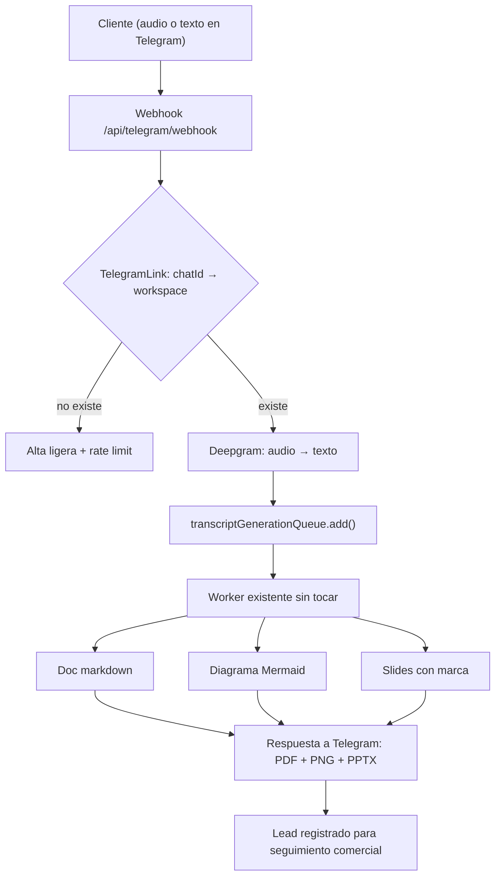

# Propuesta: "Berry" — captación de clientes vía Telegram sobre Plan AI

**Fecha:** 2026-07-23
**Autor:** Xavier Mas (con análisis técnico sobre el código actual)
**Origen:** conversación Xavier / Noelia (COO) sobre posicionamiento y captación
**Estado:** propuesta — pendiente de decisión

---

## 1. Resumen ejecutivo

Proponemos exponer el backend de Plan AI a través de un bot de Telegram ("Berry") para usarlo como **herramienta de captación comercial**: el cliente potencial manda un audio o un mensaje describiendo lo que quiere, y en menos de un minuto recibe un documento estructurado, un diagrama de arquitectura y unas slides con nuestra marca.

**La tesis:** no construimos un producto nuevo. Construimos **un canal nuevo sobre un producto que ya está terminado y en producción**. El 90% del trabajo ya está escrito, probado y desplegado.

**Coste estimado:** 5–8 días de un ingeniero para un piloto usable internamente.

---

## 2. De dónde sale esto

En la conversación surgieron dos posturas que parecían opuestas y en realidad son complementarias:

- **Noelia:** un competidor le enseñó a un cliente un flujo en el que mandaba una orden por el móvil y recibía dos diseños para elegir. El cliente quedó impresionado y se cerró la venta. El punto no es la tecnología, es **el efecto sobre el cliente y la reducción del ciclo de venta**.
- **Xavier:** por detrás eso es un LLM, no "un ejército de agentes". Vender lo contrario es una trampa de marketing.

Las dos cosas son ciertas. La conclusión operativa es que **el efecto es real y vale dinero, y nosotros podemos producirlo sin mentir**, porque a diferencia del competidor nosotros sí tenemos la infraestructura debajo.

---

## 3. Por qué esto NO es "abrir un ChatGPT"

Esta es la objeción que hay que poder responder, interna y externamente. La respuesta está en el código:

| Capacidad | Dónde vive hoy | Estado |
|---|---|---|
| Audio → texto (Deepgram) | `controller/audioController.ts` | ✅ Producción |
| Texto → documento markdown | `services/docGenerationService.ts` | ✅ Producción |
| Texto → diagrama Mermaid | `services/diagramGenerationService.ts` | ✅ Producción |
| Texto → slides con marca | `services/slideGenerationService.ts` | ✅ Producción |
| Texto → tickets con criterios | `workers/transcriptGenerationWorker.ts` | ✅ Producción |
| Sync a Linear / Jira / Notion / Asana | `services/*IntegrationService.ts` | ✅ Producción |
| Temas de marca por workspace | `services/brandThemeService.ts` | ✅ Producción |
| Cola asíncrona (BullMQ + Redis) | `queue/`, `workers/` — 5 colas | ✅ Producción |

Un ChatGPT devuelve texto en un chat. Nosotros devolvemos **un documento + un diagrama + unas slides con la marca del cliente + tickets sincronizados en su Linear**, desde un audio, en un canal que el cliente ya tiene instalado en el móvil.

Esa frase es defendible en una demo en directo. Es nuestro diferencial real y no depende de exagerar nada.

### El hallazgo que abarata el proyecto

`queue/transcriptGenerationQueue.ts` ya define este payload:

```ts
export interface TranscriptGenerationJobPayload {
  content: string;
  userId: string;
  workspaceId: string;
  persona?: "SECRETARY" | "ARCHITECT" | "PRODUCT_MANAGER" | "DEVELOPER";
  createDoc?: boolean;
  createSlides?: boolean;
  syncToLinear?: boolean;
  // …
}
```

**El pipeline completo se dispara con un solo push a la cola.** No hay que orquestar nada nuevo: el trabajo de integración se reduce a traducir un mensaje de Telegram a este objeto. Esto es lo que convierte el proyecto de "semanas" a "días".

---

## 4. Lo que SÍ hay que construir

Seamos honestos con el alcance. Falta esto:

### 4.1 Webhook de Telegram (fácil — hay precedente)

Ya tenemos dos endpoints públicos con verificación de firma en producción:

- `POST /api/billing/webhook` (Stripe, verifica firma contra el raw body)
- `POST /api/integrations/github/webhook`

El de Telegram sigue exactamente el mismo patrón, validando el `secret_token`. Es trabajo conocido.

### 4.2 Identidad: el problema real (medio — es el grueso del trabajo)

**Este es el único punto arquitectónicamente no trivial y hay que decidirlo antes de empezar.**

Todo el backend asume un usuario de Firebase y resuelve el workspace a partir de él:

```ts
const user = await prisma.user.findUnique({ where: { firebaseUid: request.user.uid } });
```

Un cliente potencial en Telegram **no tiene cuenta**. Y por la arquitectura BYOK, las claves de OpenRouter y Deepgram viven en el `Workspace` (`schema.prisma:57-58`), no globalmente. Sin workspace no hay claves y no hay generación.

**Recomendación:** un workspace propio de BlueberryBytes ("Berry Sales") con nuestras claves, y una tabla nueva `TelegramLink` que mapee `telegramChatId` → ese workspace + un usuario de servicio. Los prospects nunca tienen cuenta: consumen *nuestro* workspace, que es lo correcto porque **es gasto de marketing, no de producto**.

Implicación directa: **cada conversación de un prospect gasta nuestros créditos de OpenRouter.** Hay que ponerle un límite por chat desde el día uno (ver riesgos).

### 4.3 Formato de salida a Telegram (fácil, algo tedioso)

Telegram no renderiza Mermaid ni markdown enriquecido. Pero ya resolvimos esto en móvil: `plan-ai-mobile/src/components/MermaidViewer.tsx` renderiza vía `mermaid.ink` mandando el código en base64 y recibiendo una imagen. **Mismo truco, mismo servicio, código ya escrito.** El doc va como PDF adjunto y las slides como PPTX adjunto.

### 4.4 Corrección sobre lo que dije en la llamada

Dije que el "estamos trabajando, en unas horas lo tenemos" era literalmente nuestra cola de BullMQ. **Es cierto solo en parte** y conviene tenerlo claro:

- El pipeline de transcript → tickets **sí** pasa por cola (`transcriptGenerationWorker`).
- La generación de documentos **no**: `docGenerationService.startGeneration()` lanza `generateBackground()` como fire-and-forget en proceso (`docGenerationService.ts:117`), con estado `GENERATING` en base de datos.

En la práctica esto **juega a favor**: el documento y el diagrama salen en segundos, no en horas. El "lo tienes mañana" se reserva para el prototipo de verdad, que es trabajo humano — y eso es exactamente lo que queremos poder decir sin mentir.

---

## 5. Arquitectura propuesta



Lo importante del diagrama: **de `E` a `J` no se toca nada**. Todo eso ya existe y está en producción. El trabajo nuevo son las cajas `B`, `C`, `D` y `K`.

---

## 6. Plan por fases

| Fase | Alcance | Estimación |
|---|---|---|
| **1. Piloto interno** | Webhook + `TelegramLink` + texto → doc + diagrama. Solo lo usamos nosotros. | 3–4 días |
| **2. Demo comercial** | Audio (Deepgram), slides con marca, PDF/PPTX adjuntos, límites de uso. | 2–3 días |
| **3. Validación** | Lo usamos en 3–5 reuniones de venta reales y medimos si convierte. | 2–3 semanas (sin desarrollo) |
| **4. Producto** | Solo si la fase 3 convierte: nombre, web, posicionamiento. | A decidir |

**La fase 3 es la que importa y es la que no cuesta código.** No invertimos en marca hasta tener evidencia de que el flujo cierra ventas. Si no convierte, hemos gastado una semana y nos hemos quedado con un bot útil internamente.

---

## 7. Riesgos y cómo los mitigamos

| Riesgo | Gravedad | Mitigación |
|---|---|---|
| **Decir "nuestros agentes lo están construyendo" cuando lo construye una persona** | 🔴 Alta | Redactar como "generado con IA, revisado por nuestro equipo". Mismo efecto comercial, cero exposición si el cliente pregunta cómo funciona. Es cierto, y perder un contrato por esto sale mucho más caro que el wow que aporta. |
| **Coste descontrolado de OpenRouter** | 🟠 Media | Límite duro por `telegramChatId` (p. ej. 5 generaciones/día). El bot es marketing; sin tope, un mal actor nos vacía los créditos. |
| **Endpoint público sin autenticar** | 🟠 Media | Verificación de `secret_token` + rate limit, igual que el webhook de Stripe. Patrón ya probado en el repo. |
| **Expectativas: el cliente cree que el prototipo está hecho** | 🟠 Media | Guion de venta explícito: esto es un *diseño*, el prototipo funcional viene después y tiene precio. |
| **Calidad irregular del LLM en una demo en directo** | 🟡 Baja | Probar en fase 3 con prospects reales pero de bajo riesgo antes de usarlo en una venta grande. |

---

## 8. Posicionamiento y nombres

Sobre el punto de Noelia de renombrar los roles (prototyper / builder / reviewer):

**Recomendación: hacerlo, pero sin inventar categoría en los roles.** Renombrar los perfiles en la web es barato (una tarde), alinea con el vocabulario que el mercado ya usa, y no cuesta credibilidad porque *todo el mundo* lo está haciendo. Llegamos tarde a esa ola, así que la copiamos y ya está — no es ahí donde ganamos.

**Donde sí conviene inventar categoría es en el método, no en los cargos.** Inventarse un término tipo "loop engineering" solo funciona si hay un artefacto que lo respalde; si no, se nota y resta. Nosotros sí tenemos el artefacto: **somos los únicos que podemos ir de la reunión al prototipo sin que nadie escriba una nota**. Eso es demostrable en directo en una llamada, que es la única forma de posicionamiento que no se puede copiar con una landing.

Resumen: **los cargos, cópialos del mercado. La categoría, constrúyela sobre lo único que tenemos y los demás no.**

---

## 9. Decisión que hay que tomar

1. **¿Adelante con la fase 1?** (3–4 días de un ingeniero)
2. **¿Confirmamos el modelo de identidad** — workspace propio "Berry Sales" con nuestras claves y nuestro gasto?
3. **¿Aceptamos la regla de comunicación** de no atribuir a agentes autónomos el trabajo que hace una persona?

Mi recomendación es sí a las tres. El coste es bajo, el trabajo pesado ya está hecho y pagado, y la fase 3 nos da evidencia real antes de gastar un euro en marca.

---

## Anexo: referencias al código

- `plan-ai/backend/src/queue/transcriptGenerationQueue.ts` — payload que ya soporta `createDoc` / `createSlides` / `syncToLinear`
- `plan-ai/backend/src/workers/transcriptGenerationWorker.ts` — orquestador del pipeline
- `plan-ai/backend/src/services/docGenerationService.ts:91` — `startGeneration()`
- `plan-ai/backend/src/services/diagramGenerationService.ts:36` — `triggerGeneration()`
- `plan-ai/backend/src/services/slideGenerationService.ts:51` — `startPresentationGeneration()`
- `plan-ai/backend/src/controller/billingController.ts:225` — patrón de webhook público con firma
- `plan-ai/backend/prisma/schema.prisma:57` — claves BYOK por workspace
- `plan-ai-mobile/src/components/MermaidViewer.tsx` — Mermaid → imagen vía `mermaid.ink`
