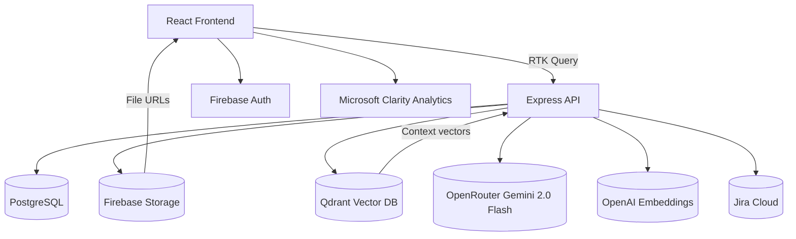

# Plan AI – Open collaboration for meeting intelligence

[](LICENSE)
[](#roadmap--status)
[](https://www.blueberrybytes.com)

Plan AI is an AI-assisted planning and execution platform that ingests meeting transcripts, surfaces context-aware insights, and keeps teams aligned through smart task boards. By open-sourcing the stack we invite the community to co-build the future of meeting intelligence while highlighting Blueberrybytes’ expertise in TypeScript-first AI systems. Try the live playground at [plan-ai.blueberrybytes.com](https://plan-ai.blueberrybytes.com).

[](https://railway.com/deploy/plan-ai)

## Why teams adopt Plan AI

- **Transcript ingestion & enrichment** – upload recordings or notes and get language detection, summaries, and action items.
- **Context-aware workspace** – vectorize knowledge bases with Qdrant so every meeting has the right background.
- **Action management** – Kanban-inspired task boards with Jira integration hooks.
- **Full-stack TypeScript** – React + RTK Query frontend, Express + TSOA backend, Prisma ORM, Firebase auth, OpenRouter (Gemini 2.0 Flash), and OpenAI embeddings.

> ✨ **Looking for a managed version or consulting?** Reach out via [projects@blueberrybytes.com](mailto:projects@blueberrybytes.com).

## Architecture at a glance



| Layer             | Tech                                                                |
| ----------------- | ------------------------------------------------------------------- |
| Frontend          | React + TypeScript, RTK Query, Firebase Auth                        |
| Backend           | Node.js, Express, TSOA, Prisma, Zod, Vitest                         |
| Data & Storage    | PostgreSQL, Qdrant Vector DB, Firebase Storage                      |
| AI & Integrations | OpenRouter (Gemini 2.0 Flash), OpenAI (embeddings), Jira, Atlassian |

## Product preview


## Chat with Context

Plan AI features a RAG (Retrieval-Augmented Generation) chat interface that allows you to converse with your uploaded data.

1.  **Create a Context**: Upload PDFs, DOCX, or text files to a "Context" in the `/contexts` page.
2.  **Start a Chat**: Go to `/chat`, create a new thread, and select one or more Contexts.
3.  **Ask Questions**: The AI (Gemini 2.0 Flash) will retrieve up to **500 relevant chunks** (leveraging its **1M token context**) from your documents and use them to answer your questions accurately. For session transcripts, it retrieves up to **1,000 chunks** for deep task extraction.

## Quick start

### Prerequisites

- Node.js `20.19.3` (`.nvmrc` provided)
- Yarn `1.22.x`
- Docker Desktop (for PostgreSQL + Qdrant)
- Firebase project (Auth + Storage) to obtain frontend/backend credentials
- Access to required environment variables (see below)

### 1. Install dependencies

```bash
yarn install:all
```

### 2. Configure environment variables

```bash
cp backend/.env.template backend/.env
cp frontend/.env.template frontend/.env
```

Update the copied files with your credentials. Both templates include inline comments describing each key.

### 3. Boot databases & dev servers

```bash
# Terminal A
yarn docker

# Terminal B
yarn dev
```

- Backend Swagger docs: <http://localhost:8080/api-docs>
- Frontend app: <http://localhost:3000>

### 4. Keep generated artifacts in sync (when APIs or Prisma schema change)

```bash
yarn update
```

This regenerates TSOA routes, Prisma client, and frontend API typings to keep both projects aligned.

## Environment reference

| File                     | Purpose                                |
| ------------------------ | -------------------------------------- |
| `backend/.env.template`  | Backend server, database, OpenAI, Jira |
| `frontend/.env.template` | Frontend runtime + Firebase config     |

Common keys (non-exhaustive):

- **Backend**: `PORT`, `FRONTEND_URL`, `DATABASE_URL`, `QDRANT_URL`, `OPENAI_API_KEY`, `OPENROUTER_API_KEY`, `FIREBASE_SERVICE_KEY`, `JIRA_CLIENT_ID`, `JIRA_CLIENT_SECRET`
- **Frontend**: `REACT_APP_API_BACKEND_URL`, `REACT_APP_FIREBASE_*`, `REACT_APP_GOOGLE_DRIVE_API_KEY`

> ℹ️ Templates include local-only defaults for convenience. Replace them when deploying to staging or production.

## Deployment guide (self-hosted)

1. **Provision infrastructure**
   - PostgreSQL 16, Qdrant 1.15+, Firebase project (Auth + Storage), OpenAI API access.
2. **Configure CI/CD secrets** mirroring the `.env` templates.
3. **Build & deploy backend**
   ```bash
   cd backend
   yarn build
   # deploy dist/ with your preferred runtime (Dockerfile / PM2 / Fly.io / etc.)
   ```
4. **Build frontend**
   ```bash
   cd frontend
   yarn build
   ```
   Serve `build/` via Netlify, Vercel, or your own CDN.
5. **Point `FRONTEND_URL` + CORS settings** at the deployed frontend URL.
6. **Run smoke tests** (lint, unit tests, manual E2E) before announcing releases.

## Releases, tags & changelog

We follow semantic versioning (`vMAJOR.MINOR.PATCH`). See [`docs/RELEASES.md`](docs/RELEASES.md) for the release checklist that covers:

1. Preparing a changelog entry (`CHANGELOG.md`)
2. Tagging the commit (e.g., `git tag v1.0.0 && git push --tags`)
3. Publishing a GitHub Release with highlights + screenshots
4. Updating repository topics (e.g., `ai`, `meeting-notes`, `firebase`, `openai`, `typescript`, `blueberry-bytes`)

## Roadmap & status

- ✅ Developer-focused alpha
- 🚧 Public beta (community feedback & stability hardening)
- 🗺️ Planned: multi-tenant deployment guides, Jira bi-directional sync, enterprise auth adapters

Create or upvote issues to influence priorities.

## Contributing

We welcome pull requests of any size:

1. Read [`CONTRIBUTING.md`](CONTRIBUTING.md) for coding standards (SOLID, tests, formatting).
2. Open a descriptive issue if you plan a larger change so we can align early.
3. Run `yarn format` + relevant lint/test commands before submitting a PR.

### Quality gates

- **Formatting**: `yarn format` runs Prettier in both packages. Pre-commit hook enforces formatting + lint via `lint-staged`.
- **Linting**: `yarn lint` runs backend ESLint (strict TypeScript rules, no `any`) and frontend ESLint. Use `yarn lint:fix` for autofixes.
- **Tests**: `yarn test:coverage` executes backend Vitest (coverage thresholds configured in `backend/vitest.config.ts`) and frontend Jest (thresholds in `frontend/package.json`).
- **Pre-push hook**: automatically triggers `yarn lint` and `yarn test:coverage` to block regressions. Disable only when pairing with CI failures to investigate.

## Community & support

- **GitHub Issues** – bugs, feature requests, docs gaps
- **Discussions (coming soon)** – share ideas & integrations
- **Direct contact** – [projects@blueberrybytes.com](mailto:projects@blueberrybytes.com)

## License

Plan AI is released under the [MIT License](LICENSE). Commercial support and custom builds are available via Blueberrybytes.

## Built bybytes

Plan AI is crafted by [Blueberrybytes](https://www.blueberrybytes.com), a consultancy focused on intelligent productivity tooling. If your team needs bespoke AI workflows, we’d love to collaborate.

## About Blueberrybytes

[Blueberrybytes](https://www.blueberrybytes.com) is a product consultancy dedicated to intelligent productivity tooling. Beyond Plan AI, the studio helps teams ship custom AI workflows, thoughtfully designed developer experiences, and scalable delivery pipelines. Visit the website to explore case studies, service offerings, and ways to partner with us on transcript-driven operations or other automation-heavy projects.

Looking for automated content ops? Check out the [Blueberrybytes Content Generator](https://content-generator.blueberrybytes.com/), a companion product that helps marketing and product teams publish consistent release notes, blog posts, and social updates with reusable AI templates.

## About the Developer – Xavier Mas Leszkiewicz

Plan AI is led by [Xavier Mas Leszkiewicz](https://xaviermasle.com), founder of Blueberrybytes and long-time champion of TypeScript-first AI systems. On his site he shares essays about building durable software companies, experiments with meeting intelligence, and behind-the-scenes notes on how Plan AI is evolving. If you want to follow the technical roadmap or collaborate directly, Xavier’s personal blog is the best place to start.
