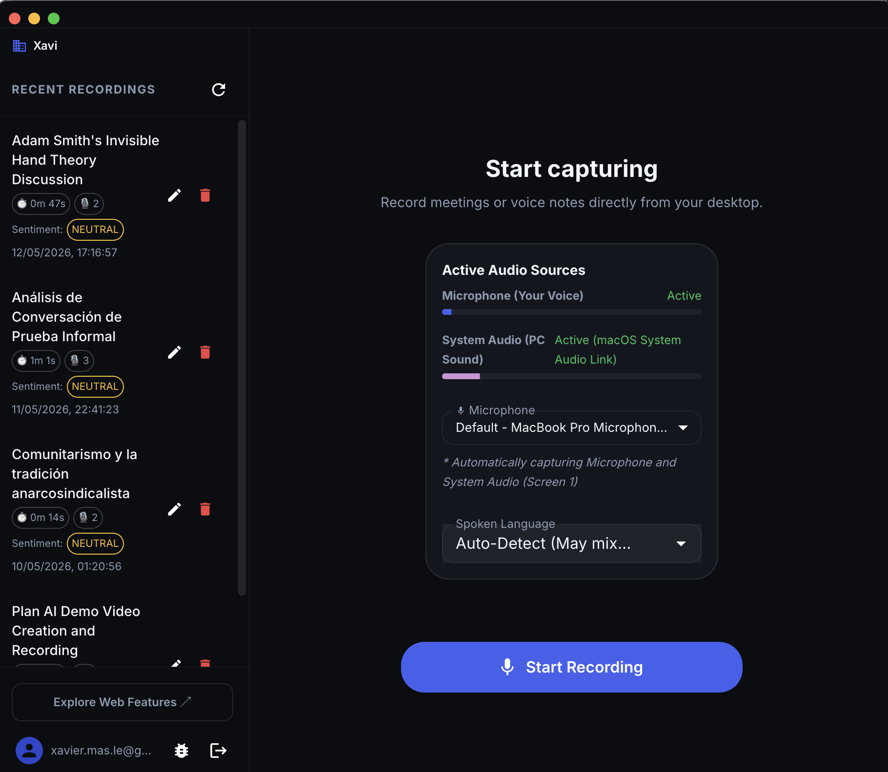
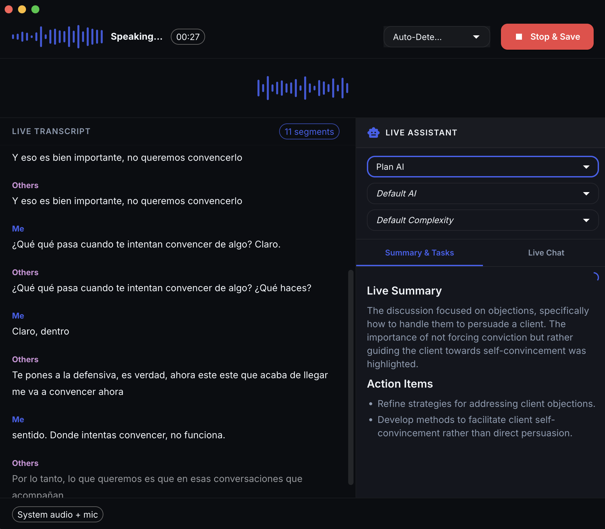
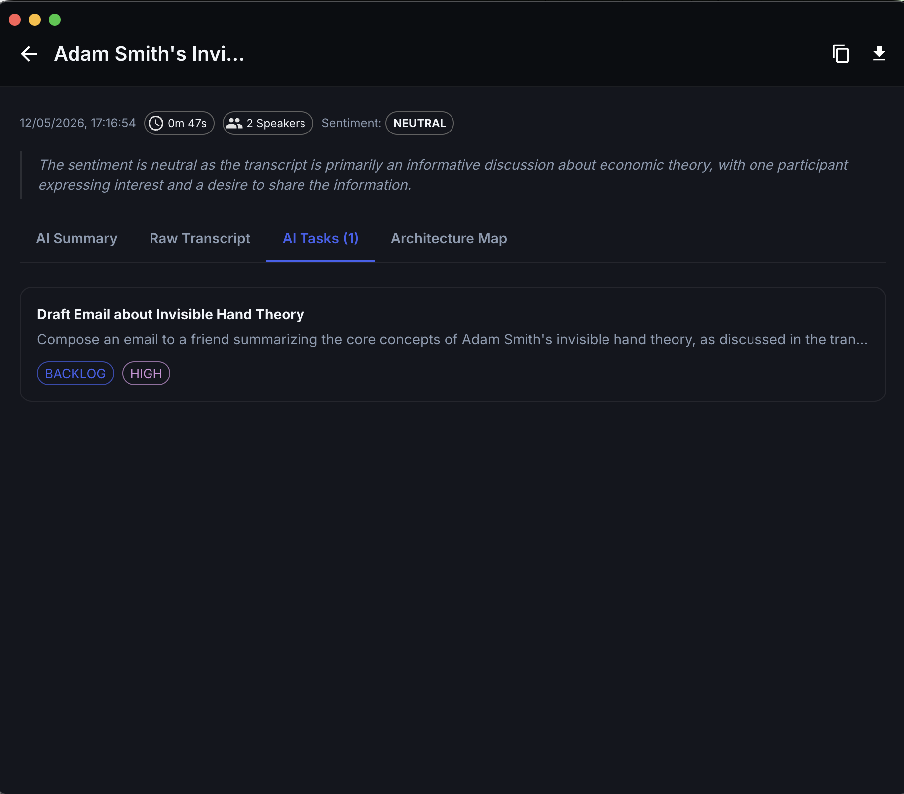
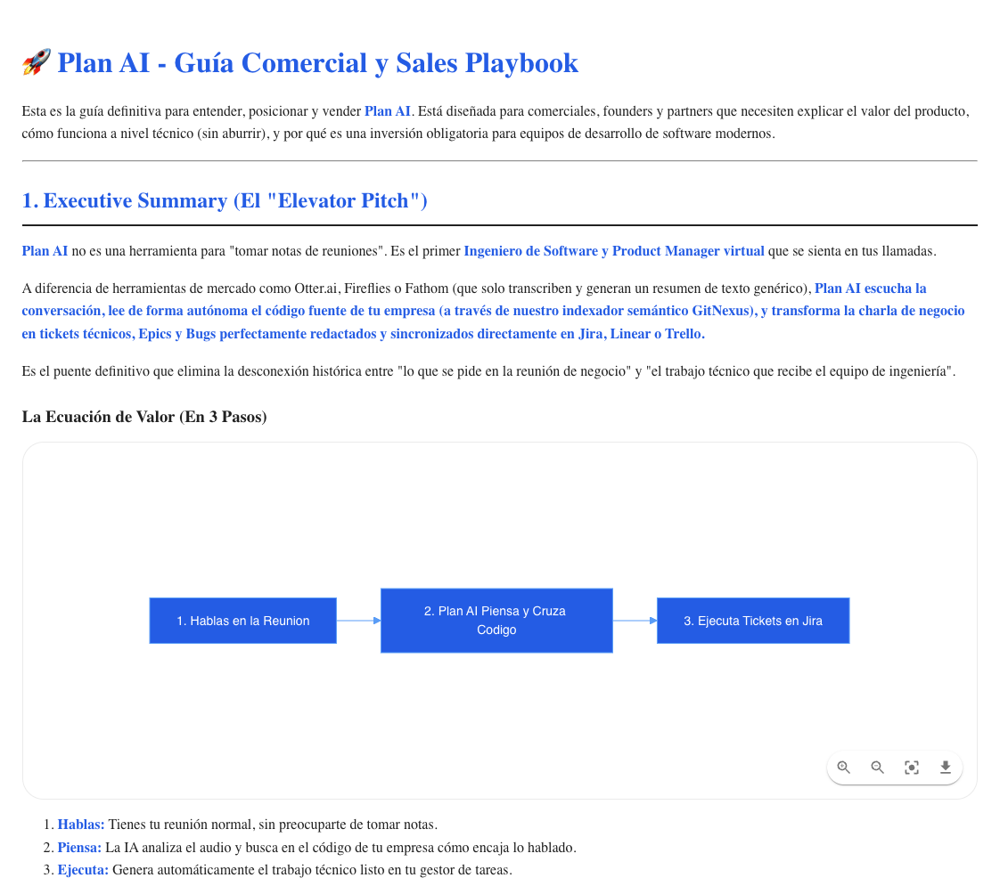
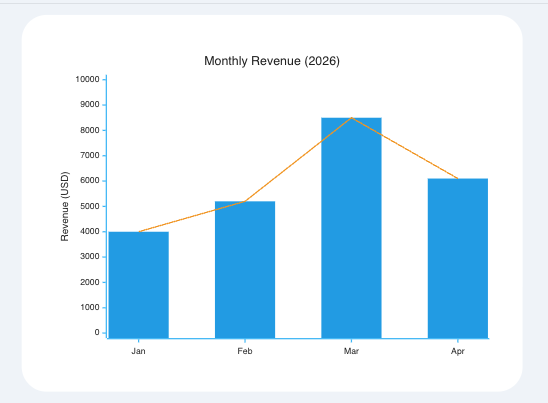
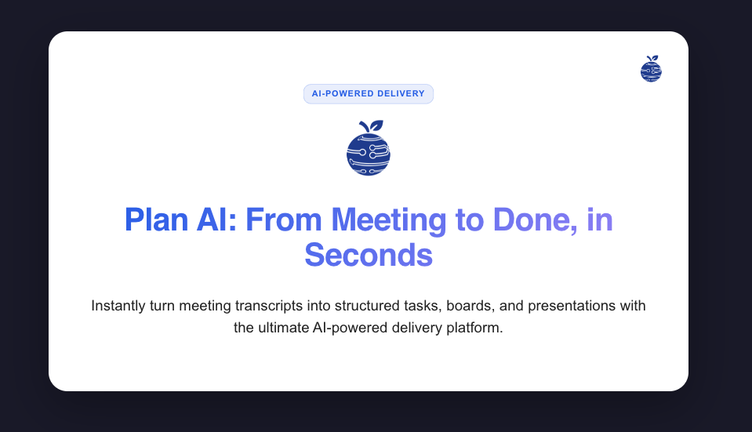
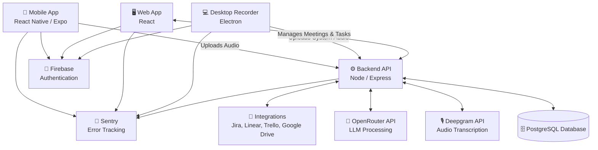
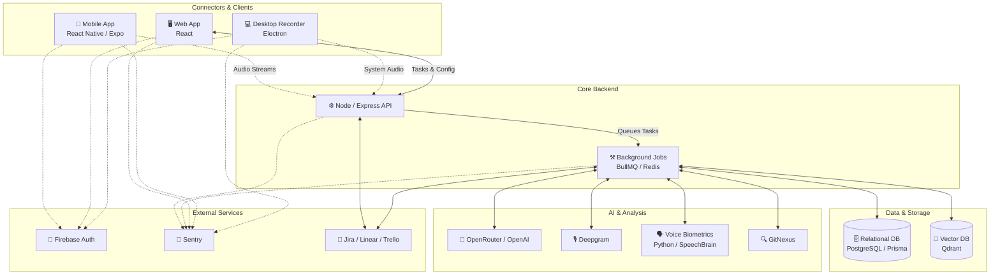

# Plan AI 🚀

**The AI meeting assistant for software teams.** Plan AI records your engineering meetings, understands your codebase via a code graph (GitNexus), and automatically ships properly scoped Jira / Linear / Trello tickets, technical specs, and architecture diagrams. Open-source core, BYOK-friendly.

## Video Demo (click on the image to watch it)

[](https://www.youtube.com/watch?v=qJBdLCjMD28)

## 🎯 Who is this for?

Plan AI is **purpose-built for software teams**. It's the meeting tool that knows what `verifyToken` is and which file it lives in.

**✅ Built for:**

- **Software agencies and consultancies** billing clients hourly — every hour saved on spec-writing is a billable hour back.
- **Product engineering teams** at startups and scale-ups using Jira / Linear / Notion who are tired of writing tickets from memory after standups.
- **Engineering managers and tech leads** who want their team's design reviews, retros, and discovery calls to produce real artifacts, not Slack threads.

**❌ Not built for:**

- Sales calls, customer success conversations, recruiting interviews — for those, use [Fathom](https://fathom.video/) or [Granola](https://granola.ai/). They're great at it.
- Marketing meetings, board meetings, generic business calls — Plan AI's value compounds with technical context. Without code, you're paying for capabilities you don't use.

If you've ever said *"we discussed this in standup, then nobody wrote it down"* — that's the problem Plan AI is built to delete.

## 🌐 Try It Live

- **Application:** [plan-ai.blueberrybytes.com](https://plan-ai.blueberrybytes.com)

## Docs

- **Documentation:** [docs.plan-ai.blueberrybytes.com](https://docs.plan-ai.blueberrybytes.com)

## The Company

This software has been developed by [BlueberryBytes](https://blueberrybytes.com).

The engineer and CEO of the Company:

- Linkedin: [Xavier Mas Leszkiewicz](https://www.linkedin.com/in/xavier-mas-leszkiewicz)
- Github: [masosky](https://github.com/masosky)

## 📥 Downloads

### 💻 Desktop Recorder

| Platform                      | Where to get it                                                                                                                                                                              |
| :---------------------------- | :------------------------------------------------------------------------------------------------------------------------------------------------------------------------------------------- |
| 🍏 **macOS**                  | [Mac App Store](https://apps.apple.com/es/app/plan-ai-recorder/id6759553699?l=en-GB&mt=12) or [GitHub Releases (.dmg)](https://github.com/blueberrybytes/plan-ai-recorder-releases/releases) |
| 🪟 **Windows** & 🐧 **Linux** | [GitHub Releases (.exe, .AppImage)](https://github.com/blueberrybytes/plan-ai-recorder-releases/releases)                                                                                    |

### 📱 Mobile Companion App

| Platform       | Where to get it                                                                                    |
| :------------- | :------------------------------------------------------------------------------------------------- |
| 🤖 **Android** | [Google Play — Plan AI](https://play.google.com/store/apps/details?id=com.blueberrybytes.planai)   |
| 🍏 **iOS**     | [App Store — Plan AI Recorder](https://apps.apple.com/us/app/plan-ai-mobile-recorder/id6762671958) |

## 📸 Sneak Peek

### 1. Native Recorder

Securely capture your meetings without invasive bots. Start recording instantly from your desktop or mobile app.



<br>

### 2. Live Meeting Assistant

While recording, you can swap the AI's context on the fly, read real-time summaries, and ask the live chat questions.



<br>

### 3. Automated Tasks

Once the meeting ends, Plan AI instantly generates perfectly scoped engineering tickets and actionable items based on the discussion.



### 4. Meeting Documents & Summaries

Export comprehensive, well-formatted markdown documents summarizing key decisions, technical discussions, and action items. You can generate these manually via the chat, or **automatically** by toggling the option in the post-recording screen.



### 5. AI Generated Diagrams

Plan AI understands technical discussions and can automatically generate Mermaid.js architecture diagrams directly from your meeting context.



### 6. Presentation Slides

Instantly convert meeting insights, proposals, or architecture plans into professional PowerPoint (.pptx) slides ready for presentation. This can be done on-demand or **automatically toggled** right after you finish your recording.



## 🧠 Bridging Tech & Non-Tech (AI Context & RAG)

Plan AI is designed to completely eliminate the friction between non-technical stakeholders (Product Managers, Designers) and technical execution (Developers and AI Agents).

We achieve this through advanced Retrieval-Augmented Generation (RAG) and intelligent repository indexing:

- **Repomix Integration:** With a simple `yarn repomix` command, the entire monorepo is efficiently packed into a single, AI-optimized markdown file.
- **Semantic Memory (Qdrant):** Meeting transcripts are instantly chunked, vectorized, and embedded in Qdrant, creating a long-term semantic memory of every architectural decision.
- **GitNexus (MCP):** We ship with a native Model Context Protocol (MCP) server that maps out the codebase graph.

**The Magic Workflow:** A non-technical Product Manager records a sprint planning meeting. Plan AI extracts a perfectly scoped GitHub Issue using historical context from Qdrant. The Developer assigns that issue to an AI Agent (like Cursor or Cline). The Agent reads the issue, consumes the `repomix.md` repository context, safely checks the blast radius using `gitnexus_impact()`, and autonomously writes the Pull Request.

## 📦 Project Structure & Architecture

Plan AI is built as a monorepo.


```mermaid
graph TD
    %% Clients
    Mobile[📱 Mobile App<br>React Native / Expo]
    Desktop[💻 Desktop Recorder<br>Electron]
    Web[🖥️ Web App<br>React]

    %% Backend & Integrations
    Backend[⚙️ Backend API<br>Node / Express]
    DB[(🗄️ PostgreSQL Database)]
    AI_Deepgram[🎙️ Deepgram API<br>Audio Transcription]
    AI_OpenRouter[🧠 OpenRouter API<br>LLM Processing]
    Auth[🔐 Firebase<br>Authentication]
    Sentry[🐛 Sentry<br>Error Tracking]
    Ext_Integrations[🔌 Integrations<br>Jira, Linear, Trello, Google Drive]

    %% Flow
    Mobile -->|Uploads Audio| Backend
    Desktop -->|Uploads System Audio| Backend
    Web <-->|Manages Meetings & Tasks| Backend
    Backend <--> DB
    Backend <--> AI_Deepgram
    Backend <--> AI_OpenRouter
    Backend <--> Ext_Integrations
    Mobile --> Auth
    Web --> Auth
    Desktop --> Auth
    Mobile --> Sentry
    Web --> Sentry
    Desktop --> Sentry
    Backend --> Sentry
```

This repository links three core components:

- **`plan-ai/`** - Contains the core platform (`backend` server and `frontend` web client).
- **`plan-ai-mobile/`** - The Expo/React Native mobile app for recording meetings on the go.
- **`plan-ai-recorder/`** - The desktop app for capturing system audio during calls.
- **`docs/`** - The VitePress documentation website.

### Internal Architecture

To understand how Plan AI processes data behind the scenes, here is a detailed breakdown of the internal stack and data flow:


```mermaid
graph TD
    %% Connectors
    subgraph Connectors[Connectors & Clients]
        Mobile[📱 Mobile App<br>React Native / Expo]
        Recorder[💻 Desktop Recorder<br>Electron]
        Web[🖥️ Web App<br>React]
    end

    %% API Layer
    subgraph Backend[Core Backend]
        API[⚙️ Node / Express API]
        Workers[⚒️ Background Jobs<br>BullMQ / Redis]
    end

    %% Data Layer
    subgraph DataLayer[Data & Storage]
        DB[(🗄️ Relational DB<br>PostgreSQL / Prisma)]
        VectorDB[(🧠 Vector DB<br>Qdrant)]
    end

    %% AI & Analysis
    subgraph Intelligence[AI & Analysis]
        LLMs[🤖 OpenRouter / OpenAI]
        Speech[🎙️ Deepgram]
        VoiceAI[🗣️ Voice Biometrics<br>Python / SpeechBrain]
        GitNexus[🔍 GitNexus]
    end

    %% External Services
    subgraph External[External Services]
        Auth[🔐 Firebase Auth]
        Monitor[🐛 Sentry]
        Integrations[🔌 Jira / Linear / Trello]
    end

    %% Flow
    Mobile -.->|Audio Streams| API
    Recorder -.->|System Audio| API
    Web <-->|Tasks & Config| API

    Mobile -.-> Auth
    Web -.-> Auth
    Recorder -.-> Auth

    API -->|Queues Tasks| Workers

    API <--> Integrations
    Workers <--> Integrations

    Workers <--> DB
    Workers <--> VectorDB

    Workers <--> Speech
    Workers <--> VoiceAI
    Workers <--> LLMs
    Workers <--> GitNexus

    API -.-> Monitor
    Workers -.-> Monitor
    Web -.-> Monitor
    Mobile -.-> Monitor
    Recorder -.-> Monitor
```

## 🚀 Quick Start

We've made it incredibly easy to spin up the entire web platform locally.

### Prerequisites

You will need a few external services configured for the platform to work:

1. **Firebase Project**: Used for user authentication. You'll need your Firebase client config for the frontend/apps, and a base64 encoded Firebase Admin SDK service account key placed in the `FIREBASE_SERVICE_KEY` environment variable for the backend.
   - For the **Mobile App**, you must download your `google-services.json` (Android) and `GoogleService-Info.plist` (iOS) from the Firebase Console and place them inside the `plan-ai-mobile/` directory. (Note: Do not commit these files to version control!)
2. **OpenRouter API Key**: Used for LLM task extraction and intelligence.
3. **Deepgram API Key**: Used for fast, accurate audio transcription.
4. **Python Microservice (Voice AI)**: For advanced speaker verification and biometrics. This is handled locally via a Python microservice using `SpeechBrain` and `uvicorn`. It runs as a Docker container.
5. **Sentry (optional)**: Error tracking. The backend reads `SENTRY_DSN`, the web frontend reads `REACT_APP_SENTRY_DSN`, and the desktop recorder reads `VITE_SENTRY_DSN`. All three are commented out in the `.env.template` files — leave them unset to disable, and the apps run fine without it.
6. **GitNexus (MCP)**: This monorepo utilizes `gitnexus` for semantic code intelligence. When using AI coding assistants (like Cline, Cursor, or Gemini), they leverage GitNexus tools (`gitnexus_query`, `gitnexus_impact`) to safely navigate the monorepo architecture and understand execution flows before modifying shared backend services.

### 1. Install Dependencies

First, ensure you have GitNexus installed globally:

```bash
npm install -g gitnexus
```

Then, you can install the dependencies across the entire monorepo with our convenient master script:

```bash
yarn install:all
```

### 2. Environment Setup

Generate the necessary environment files for all applications across the monorepo by running the setup script from the root:

```bash
yarn setup:env
```

Once the `.env` files are created, open them and insert your `OPENROUTER_API_KEY`, `DEEPGRAM_API_KEY`, and your **Firebase configuration variables** (such as project IDs and service account paths).

### 3. Start Local Services

Before starting the applications, you must start the local Postgres, Redis, and Qdrant databases via Docker:

```bash
yarn docker
```

Once the database containers are running, push the latest Prisma schema migrations to set up your tables:

```bash
yarn db:migrate
```

(Optional) Seed your local database with a default Admin user:

```bash
yarn db:seed
```

This automatically provisions `admin@plan-ai.local` (Password: `password123`) in both Firebase Auth and PostgreSQL, granting you immediate access to the Admin Dashboard without needing to manually register via the web UI!

### 4. Start the Platform

From the root of the project, use the following scripts to launch various components:

**Start the Web Platform (Frontend, Backend & Voice AI):**

```bash
yarn dev
```

_(This concurrently starts the Node server, React client, GitNexus MCP, and the Python Voice Biometrics service)_

**Start the Desktop Recorder:**

```bash
yarn dev:recorder
```

**Start the Mobile App:**

```bash
yarn dev:mobile
```

**Start the Docs Site:**

```bash
yarn dev:docs
```

## 📜 Helper Scripts

We provide several helper scripts in the root `package.json` to make development easier:

| Script                      | Description                                                                                                          |
| --------------------------- | -------------------------------------------------------------------------------------------------------------------- |
| `yarn dev`                  | Start the web frontend, backend, GitNexus, and Voice AI concurrently                                                 |
| `yarn dev:recorder`         | Start the Electron desktop recorder                                                                                  |
| `yarn dev:mobile`           | Start the Expo mobile app                                                                                            |
| `yarn dev:docs`             | Start the VitePress documentation site locally                                                                       |
| `yarn dev:voice`            | Start the Python Voice AI microservice locally using `uv` (useful if not using Docker)                               |
| `yarn install:all`          | Install dependencies across all sub-projects                                                                         |
| `yarn clean:install`        | Wipe all `node_modules` / `yarn.lock` and reinstall cleanly                                                          |
| `yarn setup:env`            | Create `.env` files from `.env.template` defaults                                                                    |
| `yarn kill-ports`           | Kill any process on ports                                                                                            |
| `yarn lint` / `yarn format` | Run linting and formatting checks                                                                                    |
| `yarn update`               | **Full schema sync** — migrates the DB, regenerates TSOA swagger, and syncs `api.d.ts` types for all three frontends |
| `yarn typecheck:all`        | Run `tsc --noEmit` across all 4 packages in parallel — fastest compile check                                         |
| `yarn build:all`            | Full `tsc` build on backend + frontend + recorder                                                                    |
| `yarn repomix`              | Packs the codebase into a single markdown file for AI assistants (ignores tests and builds automatically)            |

## 🔄 Type Safety — `api.d.ts` Workflow

All three frontends share a single source of type truth: the backend's OpenAPI/TSOA-generated `swagger.json`. Types are **never hand-written** for API response shapes.

### How it works

```
schema.prisma  ──►  TSOA Controllers  ──►  swagger.json
                                               │
                        ┌──────────────────────┼──────────────────────┐
                        ▼                      ▼                      ▼
              plan-ai/frontend        plan-ai-recorder       plan-ai-mobile
              src/types/api.d.ts      src/types/api.d.ts     src/types/api.d.ts
```

Running **`yarn update`** from the root triggers the entire chain automatically.

### Using generated types

In `planAiApi.ts` for each frontend:

```ts
import type { components } from "../types/api";

export type Workspace = components["schemas"]["WorkspaceResponse"];
export type Transcript = components["schemas"]["StandaloneTranscriptResponse"];
export type Task = components["schemas"]["TaskResponse"];
// ... all other types follow the same pattern
```

If a generated type field is typed broadly (e.g. `metadata: TsoaJsonObject`), use a **local cast** at the call site rather than reverting to a manual interface:

```ts
// ✅ correct
const status = (item.metadata as Record<string, unknown>)?.processingStatus;

// ❌ wrong — don't redefine the whole interface manually
```

### Per-app `generate:types` commands

| App                | Command                                            | Backend required?        |
| ------------------ | -------------------------------------------------- | ------------------------ |
| `plan-ai/frontend` | `yarn --cwd plan-ai/frontend generate:types:local` | No                       |
| `plan-ai-recorder` | `yarn --cwd plan-ai-recorder generate:types`       | No                       |
| `plan-ai-mobile`   | `yarn --cwd plan-ai-mobile generate:types`         | No                       |
| All at once        | `yarn update`                                      | No (includes DB migrate) |

## 🔒 Security, Roles & Self-Hosting

Plan AI is built with privacy in mind. When you self-host, your data remains completely under your control.

- **BYOK (Bring Your Own Key):** API keys for Deepgram and OpenRouter are stored per `Workspace`, not globally. Courtesy workspaces (flagged `isCourtesy`) bypass the key requirement for managed/demo accounts.
- **Key masking:** API keys are masked as `••••••••••••••••` in all API responses. The backend ignores this placeholder on `PUT` requests to avoid overwriting real keys.
- **Auto-Admin:** To make self-hosting easy, any new user who registers on your local instance is automatically granted the **`ADMIN`** role, bypassing the standard SaaS "Pending Approval" state.
- **Secrets:** All `.env` files and Google service accounts are strictly excluded from version control to prevent accidental leaks.

## 📄 License

Plan AI is licensed under the **[Business Source License 1.1 (BUSL-1.1)](LICENSE)**.

**What you can do:**

- ✅ Read, fork, modify, and run the code for **internal business purposes**
- ✅ Self-host Plan AI for your own team
- ✅ Use it for personal, academic, or non-profit projects
- ✅ Contribute back via pull requests

**What you cannot do:**

- ❌ Use the Licensed Work to provide a **commercial SaaS that competes with Plan AI**
- ❌ Resell the Licensed Work as a packaged product
- ❌ Strip or modify license notices

**Change Date:** On **2030-05-01** the Licensed Work will automatically convert to the **GNU Affero General Public License v3.0**, becoming fully open source under AGPL terms.

For commercial licensing, enterprise self-host deals, custom builds, or anything that falls outside the Additional Use Grant, contact us at [hello@blueberrybytes.com](mailto:hello@blueberrybytes.com).
