# Plan AI – From meeting to done, in seconds

[](LICENSE)
[](#roadmap--status)
[](https://www.blueberrybytes.com)

Plan AI is an AI-powered delivery platform that turns meeting transcripts into structured tasks, kanban boards, AI-generated slide decks, and contextual chat — the entire team delivery stack, powered by Gemini 2.0 Flash. By open-sourcing the stack we invite the community to co-build the future of meeting intelligence while highlighting Blueberrybytes' expertise in TypeScript-first AI systems.

Try the live app at [plan-ai.blueberrybytes.com](https://plan-ai.blueberrybytes.com) or download the native recorder at [landing.plan-ai.blueberrybytes.com](https://landing.plan-ai.blueberrybytes.com/).

[](https://railway.com/deploy/plan-ai)

---

## What it does

| Capability                    | Description                                                                                                                                                        |
| ----------------------------- | ------------------------------------------------------------------------------------------------------------------------------------------------------------------ |
| **Native macOS recorder**     | Native Electron desktop app capturing system audio and microphone via `ScreenCaptureKit` to seamlessly record and upload meetings. The recorder is not open source |
| **Transcript ingestion**      | Upload PDFs, DOCX, or raw text. AI auto-detects speakers, decisions, and action items.                                                                             |
| **AI task generation**        | Scoped, prioritised tasks with owners, due dates, and full meeting context — zero manual effort.                                                                   |
| **Kanban boards & timelines** | Switch between kanban, dependency diagrams, and roadmap views.                                                                                                     |
| **AI slide decks**            | Generate branded presentations from any prompt or context file. Pick a theme, choose a slide count (or let AI decide, up to 15), and stream the result.            |
| **Contextual RAG chat**       | Ask questions across all your sessions, transcripts, and uploaded files. Gemini retrieves up to 500 relevant chunks per query.                                     |
| **Context library**           | Upload PDFs, Word docs, or text files as reusable context for slide generation and chat.                                                                           |
| **Jira & Linear integration** | Push tasks directly from the board to your issue tracker.                                                                                                          |

---

## Architecture

```mermaid
graph TD
  Recorder[Electron macOS Recorder] -->|System Audio / Mic| BE
  FE[React 18 Frontend] -->|RTK Query / fetch streaming| BE[Express + TSOA API]
  FE --> FirebaseAuth[Firebase Auth]
  BE --> Postgres[(PostgreSQL 16)]
  BE --> FirebaseStorage[(Firebase Storage)]
  BE --> Qdrant[(Qdrant v1.15 Vector DB)]
  BE --> OpenRouter[(OpenRouter · Gemini 2.0 Flash)]
  BE --> OpenAI[(OpenAI · text-embedding-3-small)]
  BE --> Jira[(Jira Cloud OAuth)]
  Qdrant -->|RAG context chunks| BE
  FirebaseStorage -->|File URLs| FE
```



| Layer          | Tech                                                                                                      |
| -------------- | --------------------------------------------------------------------------------------------------------- |
| Recorder       | Electron, React 18, Vite, Swift (`ScreenCaptureKit`), Material UI                                         |
| Web App        | React 18, TypeScript 5.7, MUI v6, RTK Query, Redux Saga, redux-persist, i18next, react-router-dom v6      |
| Landing Page   | Next.js App Router, React 19, Tailwind CSS v4, Lucide React                                               |
| Backend        | Node.js 20, Express 4, TSOA 6, Prisma 6, Zod, Helmet, Vitest                                              |
| Data & storage | PostgreSQL 16, Qdrant v1.15, Firebase Storage                                                             |
| AI             | OpenRouter (Gemini 2.0 Flash `google/gemini-2.0-flash-001`), OpenAI embeddings (`text-embedding-3-small`) |
| Auth           | Firebase Authentication (email/password, Google OAuth, Microsoft OAuth)                                   |
| Integrations   | Jira Cloud (OAuth 2.0), Linear (schema-ready), Google Drive picker                                        |
| Observability  | OpenObserve (pino transport), Google Cloud Logging, Microsoft Clarity                                     |

---

## Product screenshots


---

## Quick start

### Prerequisites

- Node.js `20.19.3` (`.nvmrc` provided)
- Yarn `1.22.x`
- macOS (required for native recorder)
- Docker Desktop (runs PostgreSQL 16 + Qdrant v1.15)
- A Firebase project with **Authentication** and **Storage** enabled
- An [OpenRouter](https://openrouter.ai/) API key (for Gemini 2.0 Flash)
- An OpenAI API key (for embeddings)

### 1 — Install dependencies

```bash
yarn install:all
```

### 2 — Configure environment variables

```bash
cp backend/.env.template backend/.env
cp frontend/.env.template frontend/.env
```

Fill in your credentials. Both templates include inline comments for every key.

**Backend keys** (`backend/.env`):

| Key                         | Description                                           |
| --------------------------- | ----------------------------------------------------- |
| `PORT`                      | API server port (default `8080`)                      |
| `FRONTEND_URL`              | Allowed CORS origin (default `http://localhost:3000`) |
| `DATABASE_URL`              | PostgreSQL connection string                          |
| `QDRANT_URL`                | Qdrant REST URL (default `http://127.0.0.1:6333`)     |
| `QDRANT_CONTEXT_COLLECTION` | Qdrant collection name (default `context_files`)      |
| `OPENROUTER_API_KEY`        | OpenRouter key for Gemini 2.0 Flash                   |
| `OPENAI_API_KEY`            | OpenAI key for embeddings                             |
| `FIREBASE_SERVICE_KEY`      | Firebase Admin SDK service account JSON (stringified) |
| `FIREBASE_STORAGE_BUCKET`   | Firebase Storage bucket name                          |
| `JIRA_CLIENT_ID`            | Jira OAuth 2.0 client ID                              |
| `JIRA_CLIENT_SECRET`        | Jira OAuth 2.0 client secret                          |
| `API_ADMIN_KEY`             | Admin API key for service-to-service calls            |

**Frontend keys** (`frontend/.env`):

| Key                                      | Description                                         |
| ---------------------------------------- | --------------------------------------------------- |
| `REACT_APP_API_BACKEND_URL`              | Backend base URL (default `http://localhost:8080`)  |
| `REACT_APP_FIREBASE_API_KEY`             | Firebase web API key                                |
| `REACT_APP_FIREBASE_AUTH_DOMAIN`         | Firebase auth domain                                |
| `REACT_APP_FIREBASE_PROJECT_ID`          | Firebase project ID                                 |
| `REACT_APP_FIREBASE_STORAGE_BUCKET`      | Firebase storage bucket                             |
| `REACT_APP_FIREBASE_MESSAGING_SENDER_ID` | Firebase messaging sender ID                        |
| `REACT_APP_FIREBASE_APP_ID`              | Firebase app ID                                     |
| `REACT_APP_FIREBASE_MEASUREMENT_ID`      | Firebase Analytics measurement ID                   |
| `REACT_APP_ENABLE_REMOTE_LOGS`           | Enable OpenObserve remote logging (`false` locally) |

### 3 — Start databases and dev servers

```bash
# Terminal A – spin up PostgreSQL 16 + Qdrant v1.15
yarn docker

# Terminal B – backend (port 8080) + frontend (port 3000) concurrently
yarn dev
```

- **Backend Swagger**: <http://localhost:8080/api-docs>
- **Frontend app**: <http://localhost:3000>

### 4 — Keep generated artefacts in sync

Run this after changing the Prisma schema or any TSOA controller:

```bash
yarn update
```

This regenerates TSOA routes, the Prisma client, and the frontend `api.d.ts` type definitions.

---

## Project structure

```
plan-ai/
├── landing/             # Next.js Public Landing Page (Downloads & Marketing)
├── recorder/            # Electron macOS Recorder app (React + Swift + Vite)
├── backend/
│   ├── src/
│   │   ├── controller/          # TSOA controllers (REST routes)
│   │   ├── services/            # Business logic (slideGenerationService, etc.)
│   │   ├── middleware/          # Firebase auth middleware (BearerAuth, AdminOnly)
│   │   ├── prisma/              # Prisma client + schema + migrations
│   │   ├── firebase/            # Firebase Admin SDK initialisation
│   │   └── utils/               # Logger, env helpers
│   ├── .env.template
│   └── Dockerfile
├── frontend/
│   ├── src/
│   │   ├── pages/               # Route-level components
│   │   ├── components/          # Shared UI (SidebarLayout, ChatWindow, SlideRenderer…)
│   │   ├── store/               # Redux slices, RTK Query APIs, sagas
│   │   ├── providers/           # FirebaseAuthProvider, TokenRefreshProvider
│   │   ├── services/            # pptxExportService, tokenService
│   │   ├── hooks/               # useBrandIdentity, etc.
│   │   ├── i18n/                # react-i18next (en + es)
│   │   └── theme/               # MUI dark theme
│   ├── public/
│   │   ├── index.html           # Open Graph + Twitter Card meta tags
│   │   └── logos/
│   ├── .env.template
│   └── Dockerfile
├── docker-compose.yml           # PostgreSQL 16 + Qdrant v1.15
└── package.json                 # Root workspace scripts
```

---

## API reference

All routes are documented via **Swagger UI** at `/api-docs` when the backend is running.

| Prefix                                          | Controller                   | Auth                 |
| ----------------------------------------------- | ---------------------------- | -------------------- |
| `POST /api/session/login`                       | SessionController            | Public               |
| `GET /api/session/me`                           | SessionController            | ClientLevel          |
| `GET/PUT /account/theme`                        | AccountController            | ClientLevel          |
| `DELETE /account/self`                          | AccountController            | ClientLevel          |
| `GET/POST/PUT/DELETE /api/contexts`             | ContextController            | ClientLevel          |
| `GET/POST/PUT/DELETE /api/chat/threads`         | ChatController               | ClientLevel          |
| `POST /api/chat/threads/:id/stream`             | ChatController               | ClientLevel          |
| `POST /api/presentations/generate`              | PresentationController       | ClientLevel          |
| `GET/DELETE/PATCH /api/presentations`           | PresentationController       | ClientLevel          |
| `GET /api/public/presentations/:id`             | PublicPresentationController | Public               |
| `GET/POST/PUT/DELETE /api/slide-templates`      | SlideTemplateController      | ClientLevel          |
| `GET /api/integrations`                         | IntegrationController        | ClientLevel          |
| `GET /api/jira/auth` · `GET /api/jira/callback` | JiraController               | ClientLevel / Public |
| `GET /api/healthcheck/status`                   | HealthcheckController        | Public               |

**Auth security levels:**

- `ClientLevel` — valid Firebase ID token required (`Authorization: Bearer <token>`)
- `AdminOnly` — `ADMIN` role required (role stored in PostgreSQL)
- Public — no token required

---

## Data model

```
User ──< Session ──< Transcript
              └──< Task ──< TaskDependency
                       └──< TaskTranscriptLink

User ──< Context ──< ContextFile   (vectors stored in Qdrant)

User ──< ChatThread ──< ChatMessage

User ──< SlideTemplate ──< SlideTypeConfig
User ──< Presentation

User ──< UserIntegration   (JIRA | LINEAR)
User ── CustomTheme
```

Supported slide types: `title_only`, `text_block`, `text_image`, `bullet_list`, `two_columns`, `team_grid`, `showcase`, `stats`.

---

## AI features in depth

### Slide generation

- Model: `google/gemini-2.0-flash-001` via OpenRouter
- Streaming with Vercel AI SDK `streamObject()`
- Prompt includes template metadata, tone, audience, and RAG context chunks
- Optional `numSlides` parameter (1–15); defaults to AI-chosen slide count
- Falls back to `generateObject()` if streaming fails

### RAG chat

- Embeddings: OpenAI `text-embedding-3-small` via LangChain
- Vector store: Qdrant (`context_files` collection)
- Retrieves up to **500 chunks** for chat queries, up to **1 000 chunks** for transcript task extraction
- Context IDs passed per thread; each message triggers a fresh vector search

### Task extraction

- Same Gemini 2.0 Flash model
- Transcript text chunked via `@langchain/textsplitters` before embedding
- Extracted tasks include title, description, priority, assignee, due date, and dependency hints

---

## Deployment (self-hosted)

1. **Provision infrastructure**: PostgreSQL 16, Qdrant v1.15, Firebase project (Auth + Storage), OpenRouter and OpenAI API keys.
2. **Set CI/CD secrets** mirroring the `.env` templates.
3. **Build & deploy backend**:
   ```bash
   cd backend && yarn build
   # serve dist/ with your runtime of choice (Docker / PM2 / Fly.io / Railway)
   ```
4. **Build the web app (frontend)**:
   ```bash
   cd frontend && yarn build
   # serve build/ via Nginx, Vercel, Netlify, or a CDN
   ```
5. **Build the landing page**:
   ```bash
   cd landing && yarn pages:build
   # serve .vercel/output/static via Cloudflare Pages
   ```
6. Set `FRONTEND_URL` on the backend to your deployed frontend origin.
7. Run `yarn update` if you changed the Prisma schema or controllers before building.

The repo ships a `Dockerfile` for each package. The backend image installs FFmpeg for video processing.

---

## Development scripts

| Command                 | Description                                                   |
| ----------------------- | ------------------------------------------------------------- |
| `yarn install:all`      | Install root, backend, frontend, and recorder dependencies    |
| `yarn dev`              | Run backend + frontend dev servers concurrently               |
| `yarn dev:recorder`     | Run the native macOS Electron recorder application            |
| `yarn package:recorder` | Build the native macOS `.app` bundle from source              |
| `yarn docker`           | Start PostgreSQL + Qdrant via Docker Compose                  |
| `yarn update`           | Regenerate TSOA routes, Prisma client, and frontend API types |
| `yarn build`            | Production build for both packages                            |
| `yarn lint`             | ESLint for both packages (strict TypeScript, no `any`)        |
| `yarn lint:fix`         | Auto-fix lint issues                                          |
| `yarn format`           | Prettier across the entire monorepo                           |
| `yarn test:coverage`    | Vitest (backend) + Jest (frontend) with coverage thresholds   |

Pre-commit hooks via `lint-staged` enforce formatting + lint. A pre-push hook runs `yarn lint` and `yarn test:coverage`.

---

## Localisation

The UI ships in **English** and **Spanish** (`frontend/src/i18n/locales/`). Every user-facing string goes through `react-i18next`. Language can be switched from the landing page or the profile page without reloading.

---

## Roadmap & status

- ✅ Developer-focused alpha
- 🚧 Public beta — community feedback & stability hardening
- 🗺️ Planned: multi-tenant deployment guides, Jira bi-directional sync, Linear integration, enterprise auth adapters

Create or upvote issues to influence priorities.

---

## Contributing

We welcome pull requests of any size:

1. Read [`CONTRIBUTING.md`](CONTRIBUTING.md) for coding standards (SOLID, tests, Prettier formatting).
2. Open a descriptive issue before a large change so we can align early.
3. Run `yarn format` and `yarn lint` before submitting a PR.

---

## Releases & changelog

We follow semantic versioning (`vMAJOR.MINOR.PATCH`). See [`docs/RELEASES.md`](docs/RELEASES.md) for the release checklist (changelog entry, git tag, GitHub Release, repo topics).

---

## Community & support

- **GitHub Issues** — bugs, feature requests, docs gaps
- **Direct contact** — [projects@blueberrybytes.com](mailto:projects@blueberrybytes.com)

---

## License

Plan AI is released under the [MIT License](LICENSE). Commercial support and custom builds are available via Blueberrybytes.

---

## Built by Blueberrybytes

Plan AI is crafted by [Blueberrybytes](https://www.blueberrybytes.com), a consultancy focused on intelligent productivity tooling. If your team needs bespoke AI workflows, we'd love to collaborate.

Beyond Plan AI, the studio helps teams ship custom AI workflows, thoughtfully designed developer experiences, and scalable delivery pipelines. Looking for automated content ops? Check out the [Blueberrybytes Content Generator](https://content-generator.blueberrybytes.com/), a companion product for marketing and product teams.

Plan AI is led by [Xavier Mas Leszkiewicz](https://xaviermasle.com), founder of Blueberrybytes. Follow the technical roadmap or collaborate directly via his personal blog.
