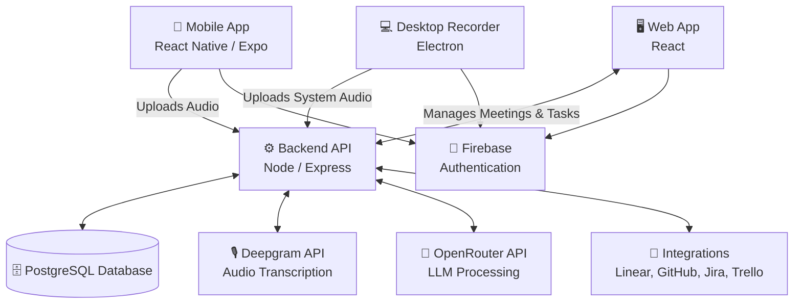
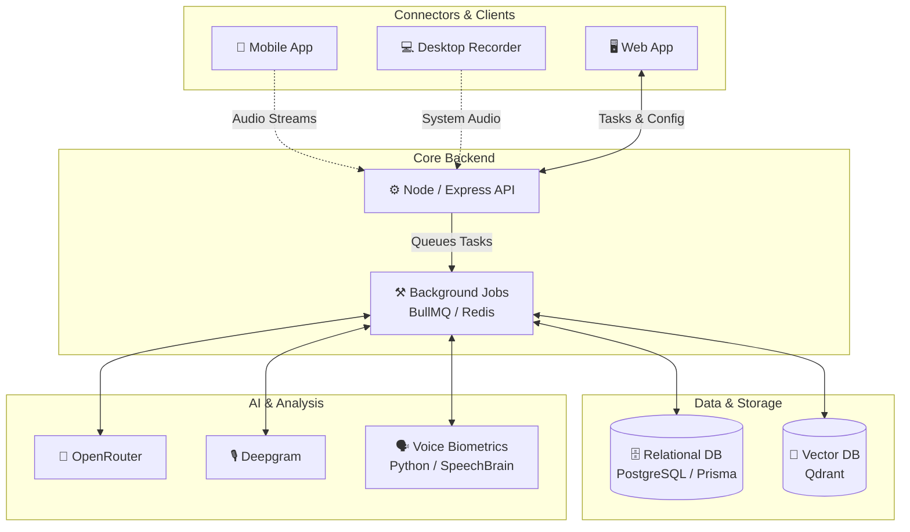
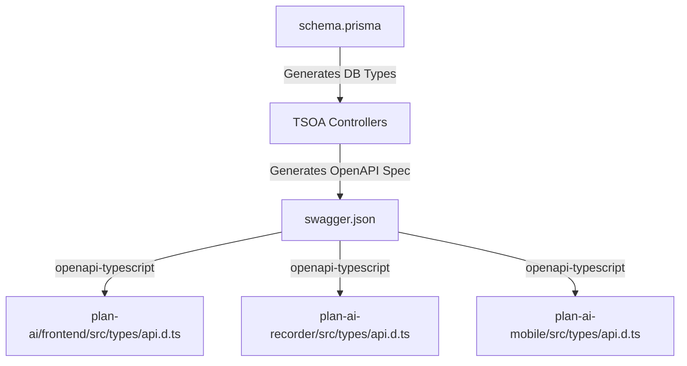

# System Architecture

Plan AI is built as a robust, modern monorepo. It leverages a microservice-inspired architecture while keeping all the code in a single repository for maximum developer velocity and perfectly synchronized TypeScript types.

## High-Level Data Flow

The platform consists of three distinct client applications that all feed into a unified backend API.

## The Backend Intelligence Pipeline

When a user finishes a meeting and the audio is uploaded from the Desktop Recorder or Mobile app, it does not get processed immediately on the main thread. 

To ensure the API remains highly responsive, we use **BullMQ and Redis** to handle the heavy lifting asynchronously.

### 1. The Voice Biometrics Service (Python)
Identifying *who* is speaking is notoriously difficult for standard LLMs. We deployed a dedicated Python microservice running `uvicorn` and `FastAPI` that uses the open-source **SpeechBrain (ECAPA-TDNN)** model. 

When the background worker receives an audio file, it sends it to this internal microservice (running on Port 8001) to perform deep mathematical speaker verification and diarization, ensuring the transcript correctly attributes sentences to the right people.

### 2. Semantic Memory (Vector DB)
We use **Qdrant** as our Vector Database. When meeting transcripts are finalized, they are chunked and vectorized. This allows the unified chat interface on the Web App to perform semantic similarity searches across hundreds of past meetings in milliseconds, fetching the exact "Context" needed to answer the user's question accurately.

## Guaranteed Type Safety

One of the largest pain points in monorepos is keeping the frontend clients perfectly synchronized with the backend database schemas. 

Plan AI uses an automated OpenAPI/Swagger generation pipeline to guarantee 100% type safety across the entire stack. Types are **never hand-written** for API response shapes.

By running `yarn update` from the root directory, the system automatically migrates the database, regenerates the Swagger specification, and pushes the exact TypeScript types out to the Web App, the Electron App, and the React Native App simultaneously.
