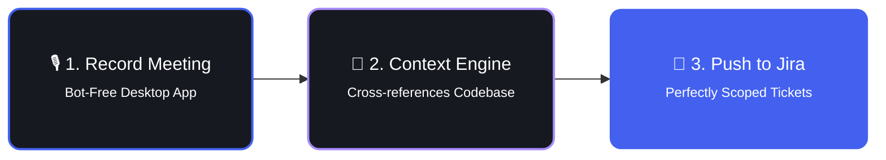

  

  <h2 style="font-size: 2.5rem; font-weight: 700; margin-bottom: 1rem; letter-spacing: -0.02em;">Sneak Peek</h2>
  

    

      
      <h3 style="margin: 0; font-size: 1.1rem; font-weight: 600;">1. Native Recorder</h3>
      
Securely capture your meetings without invasive bots. Start recording instantly from your desktop or mobile app.

    

    

      
      <h3 style="margin: 0; font-size: 1.1rem; font-weight: 600;">2. Live Meeting Assistant</h3>
      
While recording, you can swap the AI's context on the fly, read real-time summaries, and ask the live chat questions.

    

    

      
      <h3 style="margin: 0; font-size: 1.1rem; font-weight: 600;">3. Automated Tasks</h3>
      
Once the meeting ends, Plan AI instantly generates perfectly scoped engineering tickets and actionable items based on the discussion.

    

  

  <h2 style="font-size: 2.5rem; font-weight: 700; margin-bottom: 1rem; letter-spacing: -0.02em;">The Wedge Workflow</h2>
  
Stop writing manual acceptance criteria. Let the context engine do the heavy lifting.

  

  <h2 style="font-size: 2.5rem; font-weight: 700; margin-bottom: 1rem; letter-spacing: -0.02em;">Bridging Tech & Non-Tech (AI RAG)</h2>
  
Plan AI isn't just a meeting transcriber; it's a context bridge between Product Managers and AI Coding Assistants.

  

    

      <h3 style="margin: 0; font-size: 1.1rem; font-weight: 600;">📦 Repomix Integration</h3>
      
We bundle your entire monorepo into a single, AI-optimized markdown file, allowing Cursor or Cline to ingest context instantly.

    

    

      <h3 style="margin: 0; font-size: 1.1rem; font-weight: 600;">🧠 Semantic Memory (Qdrant)</h3>
      
Meeting transcripts are chunked and vectorized, creating a long-term semantic memory of every architectural decision.

    

    

      <h3 style="margin: 0; font-size: 1.1rem; font-weight: 600;">🔍 Plan Cortex</h3>
      
We ship with a native Model Context Protocol (MCP) server that maps out the codebase graph to avoid AI hallucinations.

    

  

